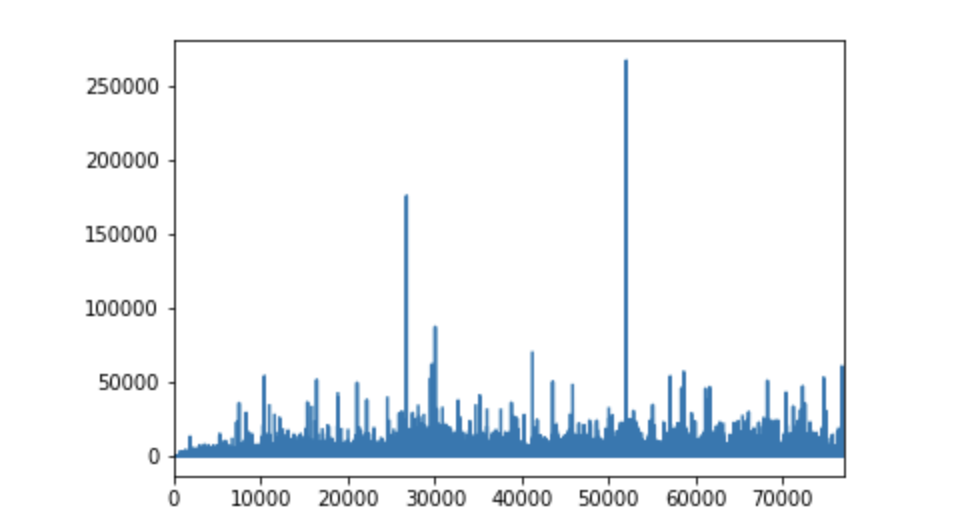
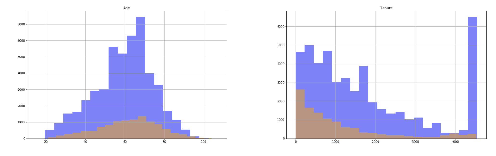
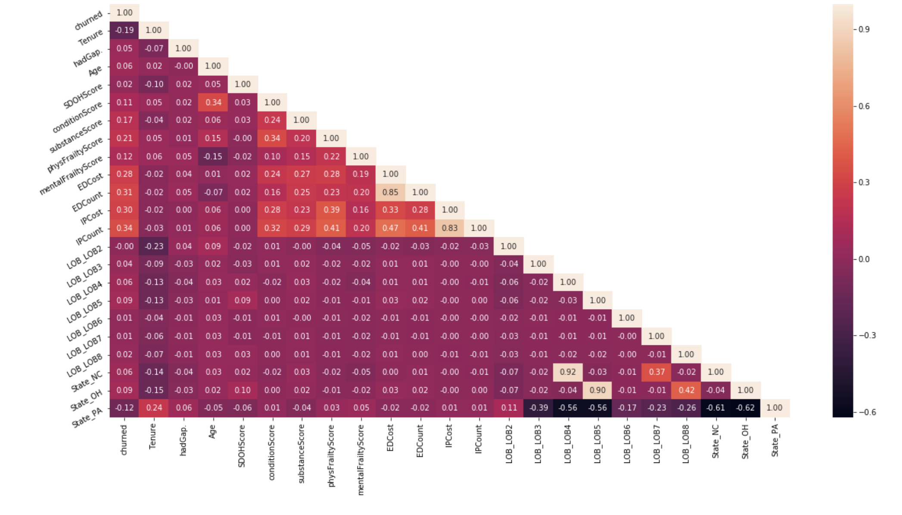
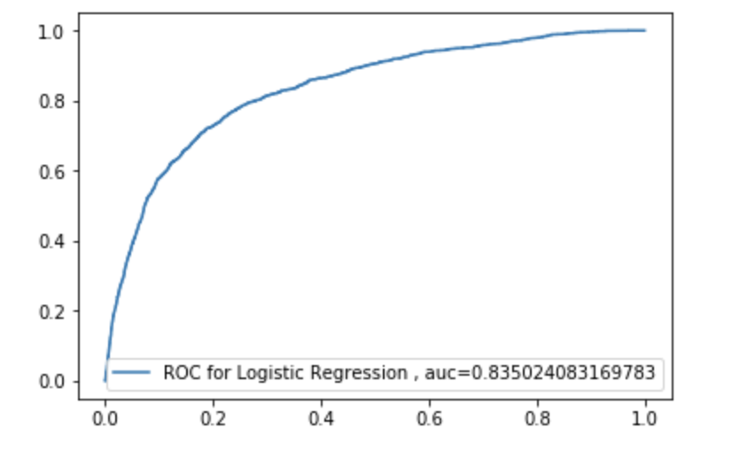
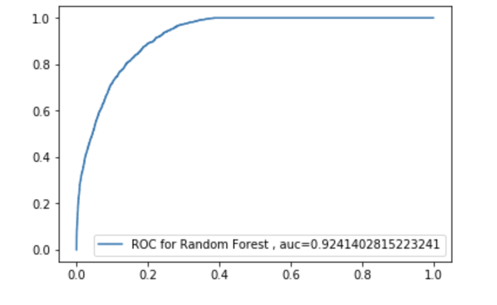

Developed a Churn prediction model to identify members who are likely to disenroll from a plan with 87% accuracy by building a Random Forest model on a Medicare Insurance company dataset of 79k users & found out the greatest contributing factors to user churn.

## Steps Followed

1. Data Sanity Check:

a. Removed Rows with duplicate member_id
b. Removed outliers from some of the columns

2. Checked relationship between each variable and Churn prediction variable by plotting graphs

Some of the graphs are shown below:

3. Check for Multicollinearity

4. Standardizing and splitting the data into Training and testing sets

5. Applying Machine Learning models 
 ## a. Logistic Regression Model
 
 
 
 ## b. Random Forest Model
 
  
 
6. Model Comparision

We now have to decide which model is better.

There are 2 criterias, I followed:

1. First find out Precision is more important or Recall
2. Area Under the Curve
Precision Vs Recall

If a customer who is not likely to churn and our model predicts that customer will churn & accordingly we send them offers/deals. So even if that customer receives this marketing message, we should be less corned about that. This is precision. How many predicted churn customers will actually churn

If we are missing out on customers who will churn and do not send them offers then that would be more crucial in our case. This is Recall. Recall is basically finding out how many of the customers who will actually churn, did we find out correctly.

ROC curve makes it easy to identify the best threshold value for making a decision. AUC curve can help us find out which model is better, because it doesn't worry about the threshold value that we choose to make decision.

First based on AUC, definetly Random Forest performed better than Logistic Regression.

